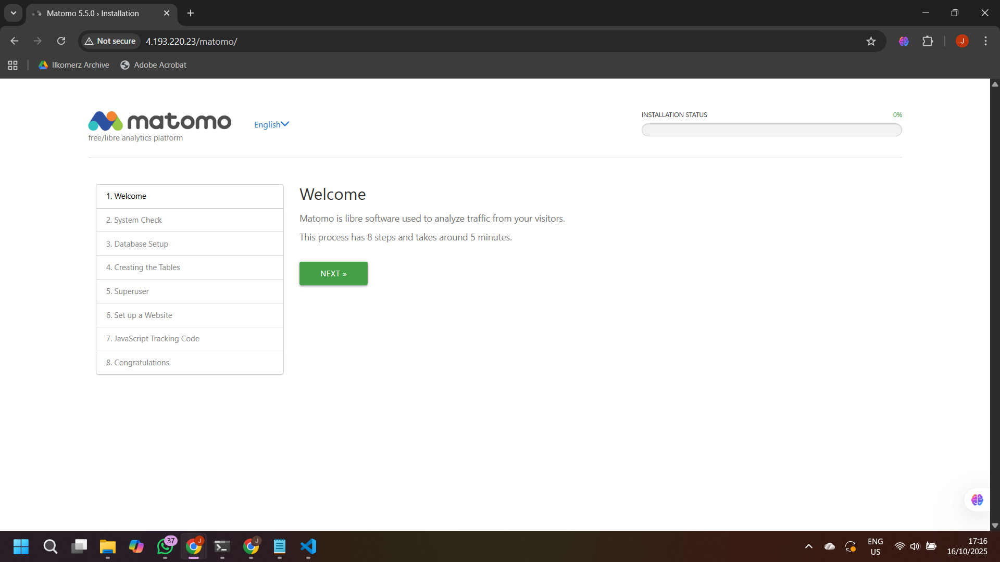
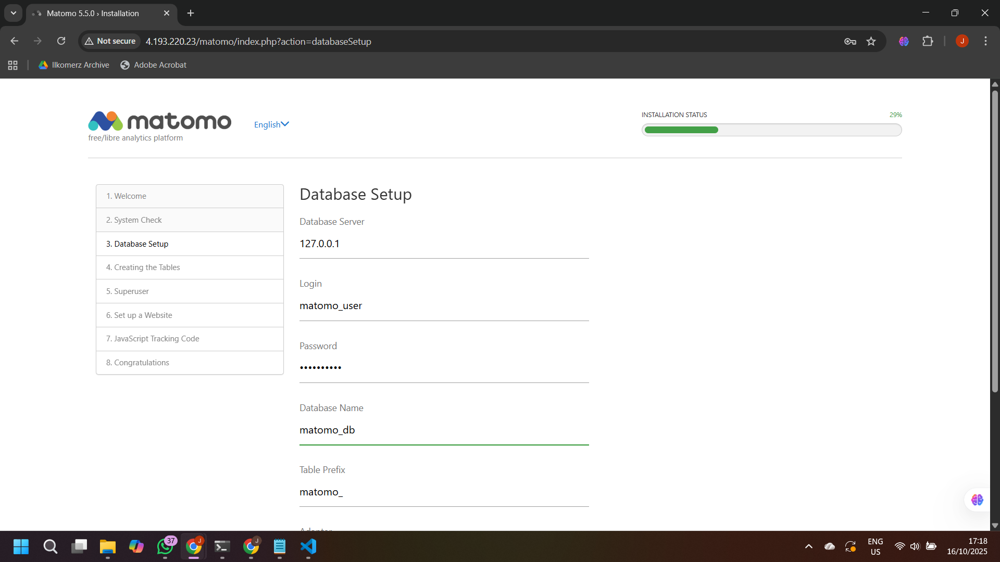

# Tentang Matomo
<h1 align="center"></h1>

Matomo adalah aplikasi analitik web gratis dan sumber terbuka yang paling umum untuk melacak kunjungan daring ke satu atau beberapa situs web dan menampilkan laporan tentang kunjungan tersebut untuk dianalisis.


## Panduan Instalasi Matomo di Server Linux

Berikut adalah langkah-langkah untuk instalasi Matomo, meliputi pembaruan sistem, instalasi dependensi, penyiapan basis data, hingga konfigurasi izin direktori.

### 1\. Login ke Azure

Login dengan akun Azure di Azure WM (Ubuntu)

```bash
az login --use-device-code
```

Buka link yang diberikan dan masukkan kode yang muncul pada terminal.

### 2\. Pembuatan Resource Group

Lakukan pembuatan resource group sehingga semua komponen tertata dengan rapi

```bash
az group create --name matomo-rg --location southeastasia
```

### 3\. Pembuatan VM Ubuntu

Pembuatan server virtual, lengkap dengan akses SSH, jaringan, dan IP publik.

```bash
az vm create \
  --resource-group matomo-rg \
  --name matomo-vm \
  --image Ubuntu2204 \
  --admin-username azureuser \
  --generate-ssh-keys \
  --size Standard_B1s
```

Tampilkan IP publik yang telah dibuat

```bash
az vm show -d -g matomo-rg -n matomo-vm --query publicIps -o tsv
```

### 4\. Buka Port HTTP

```bash
az vm open-port --resource-group matomo-rg --name matomo-vm --port 80
```

### 5\. SSH ke VM dari WSL

Ganti `'<IP-PUBLIC>'` dengan IP publik yang telah didapatkan sebelumnya.

```bash
ssh azureuser@<IP-PUBLIC>
```

### 6\. Pembaruan Sistem dan Instalasi Dependensi

Lakukan pembaruan sistem operasi dan instal paket dependensi yang diperlukan seperti Apache, MySQL, dan modul PHP pendukung.

```bash
sudo apt update && sudo apt upgrade -y
sudo apt install apache2 mysql-server php php-mysql php-xml php-curl php-gd php-cli php-mbstring unzip -y
```

### 7\. Penyiapan Database 

Akses shell MySQL sebagai pengguna root untuk membuat basis data baru dan pengguna khusus untuk Matomo. Ganti `'passwordku'` dengan kata sandi yang kuat.

```bash
sudo mysql -u root
```

Setelah prompt MySQL muncul, jalankan *query* berikut:

```sql
CREATE DATABASE matomo_db;
CREATE USER 'matomo_user'@'localhost' IDENTIFIED BY 'passwordku';
GRANT ALL PRIVILEGES ON matomo_db.* TO 'matomo_user'@'localhost';
FLUSH PRIVILEGES;
EXIT;
```

### 8\. Pengunduhan dan Ekstraksi Matomo

Masuk ke direktori *web root* (`/var/www/html`), unduh berkas instalasi Matomo, dan ekstrak isinya.

```bash
cd /var/www/html
sudo wget https://builds.matomo.org/matomo.zip
sudo unzip matomo.zip
```

### 9\. Konfigurasi Izin Direktori

Atur izin kepemilikan dan akses direktori Matomo agar web server Apache (pengguna `www-data`) dapat memproses berkas dan folder.

```bash
sudo chown -R www-data:www-data /var/www/html/matomo
sudo chmod -R 755 /var/www/html/matomo
```

### 10\. Penyelesaian Instalasi Web

Kunjungi alamat IP untuk melanjutkan server

```
http://<IP-PUBLIC>/matomo
```

- Klik `'NEXT'` pada laman Welcome

- Isi database server, login, password, dan nama database seperti pada kode


