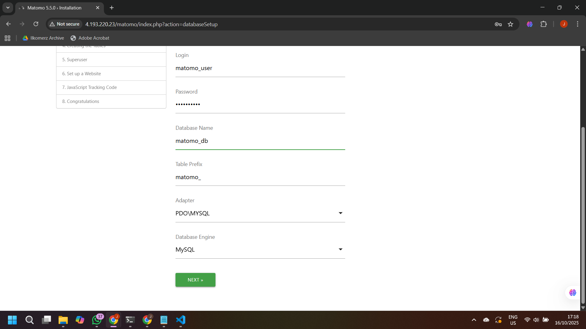
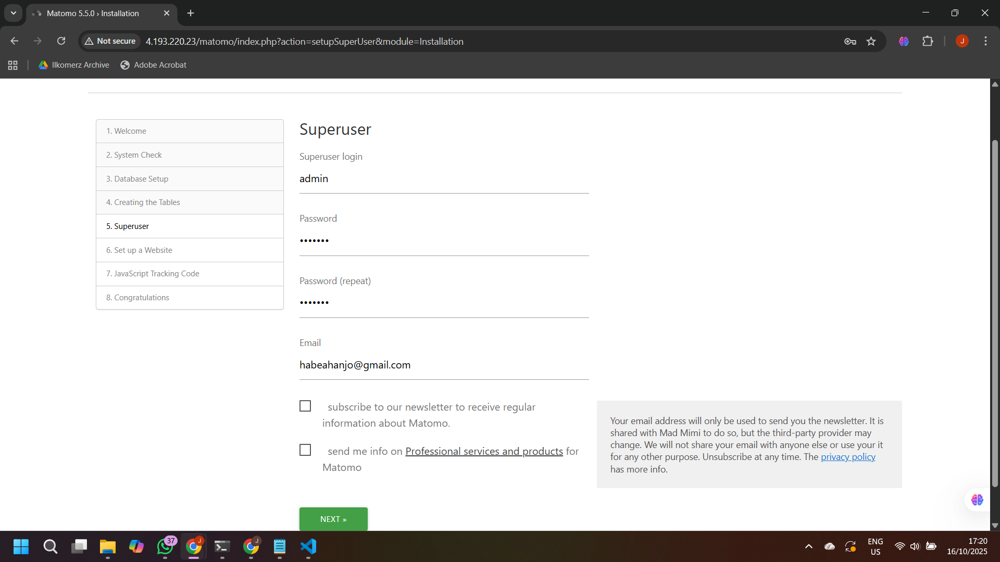
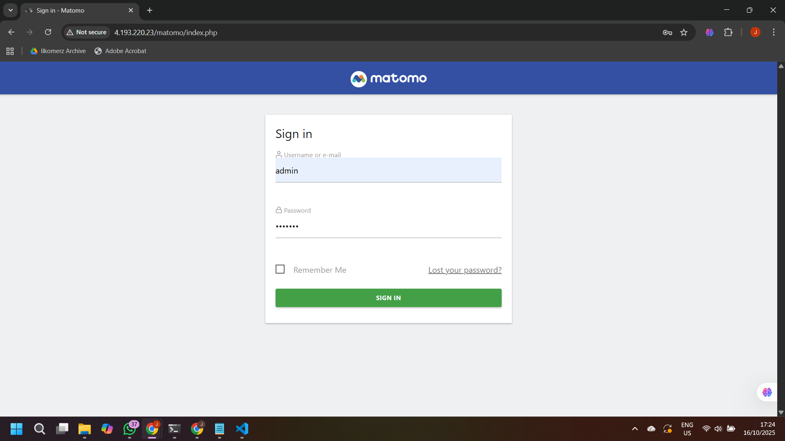
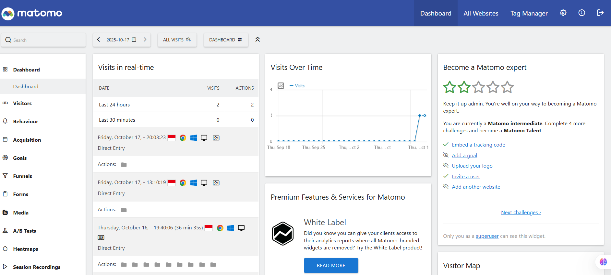
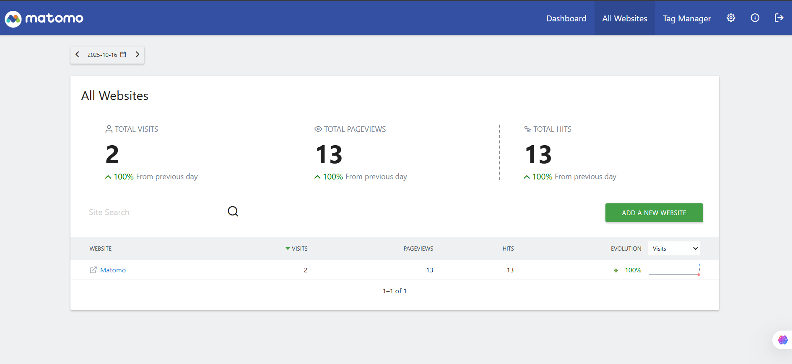
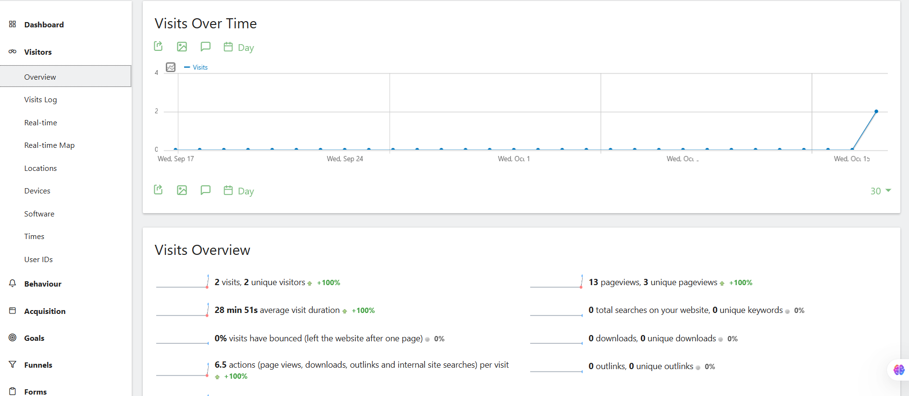
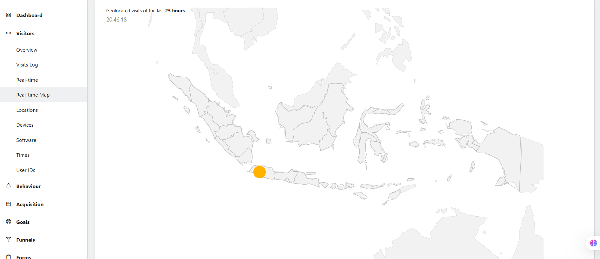

# Tentang Matomo
<h1 align="center"></h1>

Matomo adalah aplikasi analitik web gratis dan sumber terbuka yang paling umum untuk melacak kunjungan daring ke satu atau beberapa situs web dan menampilkan laporan tentang kunjungan tersebut untuk dianalisis.


## Panduan Instalasi Matomo di Server Linux

Berikut adalah langkah-langkah untuk instalasi Matomo, meliputi pembaruan sistem, instalasi dependensi, penyiapan basis data, hingga konfigurasi izin direktori.

### 1\. Login ke Azure

Login dengan akun Azure di Azure WM (Ubuntu)

```bash
az login --use-device-code
```

Buka link yang diberikan dan masukkan kode yang muncul pada terminal.

### 2\. Pembuatan Resource Group

Lakukan pembuatan resource group sehingga semua komponen tertata dengan rapi

```bash
az group create --name matomo-rg --location southeastasia
```

### 3\. Pembuatan VM Ubuntu

Pembuatan server virtual, lengkap dengan akses SSH, jaringan, dan IP publik.

```bash
az vm create \
  --resource-group matomo-rg \
  --name matomo-vm \
  --image Ubuntu2204 \
  --admin-username azureuser \
  --generate-ssh-keys \
  --size Standard_B1s
```

Tampilkan IP publik yang telah dibuat

```bash
az vm show -d -g matomo-rg -n matomo-vm --query publicIps -o tsv
```

### 4\. Buka Port HTTP

```bash
az vm open-port --resource-group matomo-rg --name matomo-vm --port 80
```

### 5\. SSH ke VM dari WSL

Ganti `'<IP-PUBLIC>'` dengan IP publik yang telah didapatkan sebelumnya.

```bash
ssh azureuser@<IP-PUBLIC>
```

### 6\. Pembaruan Sistem dan Instalasi Dependensi

Lakukan pembaruan sistem operasi dan instal paket dependensi yang diperlukan seperti Apache, MySQL, dan modul PHP pendukung.

```bash
sudo apt update && sudo apt upgrade -y
sudo apt install apache2 mysql-server php php-mysql php-xml php-curl php-gd php-cli php-mbstring unzip -y
```

### 7\. Penyiapan Database 

Akses shell MySQL sebagai pengguna root untuk membuat basis data baru dan pengguna khusus untuk Matomo. Ganti `'passwordku'` dengan kata sandi yang kuat.

```bash
sudo mysql -u root
```

Setelah prompt MySQL muncul, jalankan *query* berikut:

```sql
CREATE DATABASE matomo_db;
CREATE USER 'matomo_user'@'localhost' IDENTIFIED BY 'passwordku';
GRANT ALL PRIVILEGES ON matomo_db.* TO 'matomo_user'@'localhost';
FLUSH PRIVILEGES;
EXIT;
```

### 8\. Pengunduhan dan Ekstraksi Matomo

Masuk ke direktori *web root* (`/var/www/html`), unduh berkas instalasi Matomo, dan ekstrak isinya.

```bash
cd /var/www/html
sudo wget https://builds.matomo.org/matomo.zip
sudo unzip matomo.zip
```

### 9\. Konfigurasi Izin Direktori

Atur izin kepemilikan dan akses direktori Matomo agar web server Apache (pengguna `www-data`) dapat memproses berkas dan folder.

```bash
sudo chown -R www-data:www-data /var/www/html/matomo
sudo chmod -R 755 /var/www/html/matomo
```

### 10\. Penyelesaian Instalasi Web

Kunjungi alamat IP untuk melanjutkan server

```
http://<IP-PUBLIC>/matomo
```

- Klik `'NEXT'` pada laman Welcome

- Isi database server, login, password, dan nama database seperti pada kode

  Database server: `'localhost'`
  Login: `'matomo_user'`
  Password: `'passwordku'`
  Database name: `'matomo_db'`

  
  

- Klik `'NEXT'` pada laman Creating the Table

- Isi laman Superuser. Ganti `'adminku'` dengan kata sandi yang kuat.

  Superuser login: `'admin'`
  Password: `'adminku'`
  Password (repeat): `'adminku'`
  Email: `'example@gmail.com'`

  

- Isi laman Set up a Website. 

  Website Name: `'Matomo'`
  Website URL: `'http://<IP-Public>'`
  Website Timezone: `'Indoneisa-Jakarta'`
  E-commerce: `'Not an Ecommerce Site'`

- Klik `'NEXT'` pada laman Javascript Tracking Code

- Klik `'NEXT'` pada laman Congratulations


## Panduan Cara Pemakaian Matomo

### 1\. Login ke Matomo sebagai Admin

Superuser login: `'admin'`
Password: `'adminku'`



### 2\. Overview Visitor Melalui Dashboard




## Fitur Matomo

### 1\. Dashboard


### 2\. All Websites



### 3\. Visitors

- Overview Visitors
  
- Visitor Log
  
- Real-time Map
  
- Locations
  
- Device
- 
- Software
- 
- Time
- 
- User ID
- 

### 3\. Behaviour
- 
  Pages (Halaman) Matomo, mencantumkan dua halaman yang dikunjungi (/index dan /index.html). Laporan ini menunjukkan metrik utama seperti jumlah Pageviews, Unique Pageviews, dan Bounce Rate untuk setiap halaman. Fitur ini membantu memahami konten mana yang menarik dan bagaimana pengguna berinteraksi dengan berbagai halaman di situs web .

### 4\. Acquisition
- 
  Channel Types (Jenis Saluran) dari Matomo. Ini menunjukkan bahwa semua 2 kunjungan (Visits) dan 2 pengunjung unik (Unique Visitors) berasal dari Direct Entry. Fitur ini berguna untuk menganalisis asal trafik ke situs web , membantu menilai efektivitas upaya pemasaran dan bagaimana pengguna menemukan situs.

### 5\. Goals
- 
  Evolution over the period (Evolusi selama periode): Grafik ini melacak konversi (Conversions) dari tujuan yang ditetapkan dari waktu ke waktu (di sini per hari, dari Sep 17 hingga Oct 15). Fitur ini berguna untuk memantau tren keberhasilan tujuan bisnis dan mengidentifikasi hari atau periode di mana terjadi peningkatan atau penurunan konversi.

0 conversions @ 0% overall conversion rate: Bagian ini menunjukkan ringkasan kinerja. Dalam kasus ini, tercatat 0 konversi dari semua tujuan, menghasilkan tingkat konversi keseluruhan 0%. Matomo menggunakan fitur Goals untuk mengukur sasaran bisnis penting seperti pendaftaran, pembelian, atau pengunduhan file, sehingga dapat mengetahui seberapa efektif situs Anda mencapai target.

